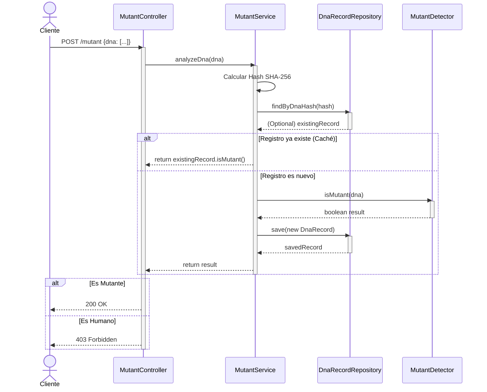

#  Mutant Detector API

API REST para detectar mutantes basándose en su secuencia de ADN. Proyecto desarrollado con Spring Boot y desplegado en Render.

## Links del Proyecto
- **URL de la API (Producción):** [https://mutantes-m5xp.onrender.com](https://mutantes-m5xp.onrender.com/swagger-ui.html)
- **Documentación Swagger:** [Ver Documentación Interactiva](https://mutantes-m5xp.onrender.com/swagger-ui.html)
- **Repositorio GitHub:** [https://github.com/natalia15012/Mutantes](https://github.com/natalia15012/Mutantes)

---

## Cómo Ejecutar Localmente
Clonar el repositorio:
   git clone [https://github.com/natalia15012/Mutantes.git](https://github.com/natalia15012/Mutantes.git)

## Diagrama de Secuencia.

